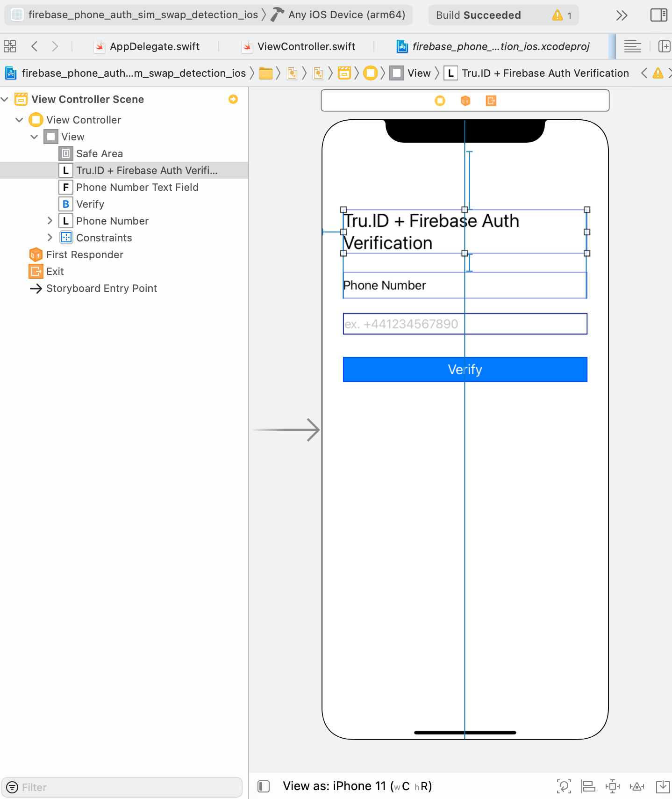
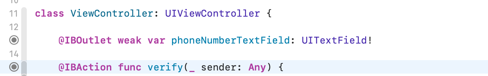

# SIM Swap Detection with iOS Firebase Phone Authentication

In this tutorial, we will take you through how to add SIM swap detection to an iOS application authenticated with Firebase Phone Auth. You will use [**tru.ID SimCheck**](https://developer.tru.id/docs/sim-check) to verify if the SIM Card associated with the mobile phone number was changed recently in order to detect any attempted [SIM swap fraud](https://en.wikipedia.org/wiki/SIM_swap_scam). 

The **tru.ID** SIMCheck API provides information on when a SIM card associated with a mobile phone number was last changed. This provides an extra layer of security in your application login flows, and can be used to detect attempted SIM swap fraud. It can be used to augment existing 2FA or anti-fraud workflows.

You can find the completed code in [firebase-phone-auth-sim-swap-detection-ios](https://github.com/tru-ID/firebase-phone-auth-sim-swap-detection-ios) GitHub repository.

## Before you begin
You will need to:
- Download  [Xcode 12.5](https://developer.apple.com/xcode/)
- Register for a developer account at [Apple Developer Portal](https://developer.apple.com/account/) if you do not have one already
- Have an iPhone or an iPad with a SIM card 
- Have [node.js](https://nodejs.org/en/download/) installed for the **tru.ID** CLI

## Set-up the **tru.ID** CLI and Run a Development Server
First, create a [tru.ID Account](https://tru.id) by clicking [Get Started](https://developer.tru.id/console) which will take you to the **tru.id** Console.
Next, you need to install the [**tru.ID** CLI](https://developer.tru.id/).:
```bash
$ npm install -g @tru_id/cli

```
Input your **tru.ID** Default Workspace Credentials as displayed at your [tru.ID console](https://developer.tru.id/console) to set up the tru.ID CLI:

```bash
$ tru setup:credentials {client_id} {client_secret} {data_residency}
```
Install [the development server plugin](https://github.com/tru-ID/firebase-phone-auth-sim-swap-detection-ios/blob/tutorial/Tutorial.md):

```bash
$ tru plugins:install @tru_id/cli-plugin-dev-server@canary
```
Create a new **tru.ID** project:

```bash
$ tru projects:create firebaseAuthSimIos
```
This saves a `tru.json` **tru.ID** project configuration to `./firebaseauthsimios/tru.json`.
Run the development server by pointing it to the newly created project directory and configuration. This will also open up a localtunnel to your development server, making it publicly accessible to the Internet, so that your mobile phone can access it when only connected to mobile data.
```bash
$ tru server --project-dir ./firebaseauthsimios
```
Take a note of the local tunnel URL, which will be needed for configuring the sample project. The URL is in the format `https://{subdomain}.loca.lt.` This is the accessible public URL to your local development server. The development server is now ready and waiting to accept calls from the app. If your tunnel has ended, you can create a new one by repeating the final step. Now, we can continue with creating our new iOS project.

## Create a New iOS Project

With the **tru.ID** account created and the development server up and running, we can start developing an application. You can skip this step if you already have an iOS project. Otherwise;

* Launch your Xcode
* File -> New -> Project
* In the "Choose a template for your new project" modal, select **App** and click Next
* Set "firebase-phone-auth-sim-swap-detection" as the Product Name, however, you can use whatever the name of your project is
* Select your Team, and make sure to assign an organization identifier using a reverse domain notation
* Keep it simple, and use a **Storyboard**, **UIKit App Delegate** and **Swift** as the development language
* Uncheck **Use Code Data** if it is checked, and click Next
* Select the folder you want to store your project in and click Next

As you see, it is a very simple project with a single ViewControlller and this is enough to demonstrate SimCheck and Firebase Phone Authentication.

If you already have Xcode and have added your developer account (Xcode->Preferences->Accounts), Xcode takes care of generating necessary certificates and provisioning profiles in order to install the app on the device.

## Add Firebase to your iOS project
Follow the instructions at the official Firebase documentation to [Add Firebase to your iOS project](https://firebase.google.com/docs/ios/setup)
The offical instructions are well detailed and easy to follow; but the steps from the offical documentation are also provided below: 
- Check the [Prerequisites](https://firebase.google.com/docs/ios/setup#prerequisites)
- Step 1: [Create a Firebase project](https://firebase.google.com/docs/ios/setup#create-firebase-project)
- Step 2: [Register your app with Firebase](https://firebase.google.com/docs/ios/setup#register-app)
- Step 3: [Add a Firebase configuration file](https://firebase.google.com/docs/ios/setup#add-config-file) 
(Drag and drop the downloaded GoogleService-Info.plist to your iOS Project. Make sure the config file name is not appended with additional characters, like (2).)
- Step 4: [Add Firebase SDKs to your app](https://firebase.google.com/docs/ios/setup#add-sdks) (Install [Cocoapods](https://guides.cocoapods.org/using/getting-started.html#getting-started) as mentioned within the Prerequisites.)
Create a Podfile if you don't already have one
```bash
    $ cd your-project-directory
```
```bash
    $ pod init
```
To your Podfile, add the Firebase pods that you want to use in your app. For this project, you need to add Firebase Auth as below:
```bash
    $ pod 'Firebase/Auth'
```
Install the pods.
```bash
    $ pod install
```
Open your `.xcworkspace` file to see the project in Xcode.

- Step 5: [Initialize Firebase in your app](https://firebase.google.com/docs/ios/setup#initialize-firebase)
The final step is to add initialization code to your application.
Import the Firebase module in your `UIApplicationDelegate`:
```swift
    import Firebase
```
Configure a [FirebaseApp](https://firebase.google.com/docs/reference/ios/firebasecore/api/reference/Classes/FIRApp) shared instance, typically in your app's `application:didFinishLaunchingWithOptions:` method:
```swift
// Use Firebase library to configure APIs
FirebaseApp.configure()
```
After completing all 5 steps, you will need to build the User Interface within your iOS Project. 
## Build the User Interface

Navigate to the `Main.storyboard`. You need to add a few UI components to receive input from the user, and provide feedback:

- Add a `UILabel` to the View Controller's view as a title with a text "Verification"
- A `UILabel` with a text "Phone number" to indicate what the next text field is for
- A `UITextField` so that the user can enter their phone number
- A `UIButton` to trigger the SIMCheck request

All UI components are "Horizontally" aligned in the container using constraints. You should also need to define constraints to anchor the components as well. You can use Reset to Suggested Constraints within Resolve Auto Layout Issues.

The view layout should look like this:



There are a few configuration options you should add for these UI components:

- Phone number `UITextField:` Select the text field, and on the **Attributes Inspector**, scroll to `Text Input Traits` and change the `Content Type` to `Telephone Number`. Also, change the `Keyboard Type` to `Phone Pad`.
- `UIImageView`: Select the `UIImageView`, and on the **Attributes Inspector**, scroll to Drawing, and check `Hidden`

Now, you need to define Outlets in the ViewController so that you can control the UI state. Let's select `ViewController` in Xcode, and then by using the `⌥` select `Main.storyboard` file. Both `ViewController.swift` and `Main.storyboard` should be opened side by side.

Select the `UITextField` you inserted to the storyboard, and with `⌃` key pressed, drag a connection from the storyboard to the `ViewController.swift.` Xcode indicates possible places in the Editor where you can create an Outlet.

When you are happy, release the keys and mouse/trackpad. You will be prompted to enter a name for the variable; type `phoneNumberTextField`.

This allows you to retrieve the phone number entered by the user. You now have one last task to do related to the storyboard.

Let's insert an action. When a user taps on the **Verify** button, you want the `ViewController` to know that the user wants to initiate the SIMCheck. So select the `Verify` button, and with your ⌃ key pressed drag a connection from the storyboard to the `ViewController.swift`. Xcode indicates possible places where you can create an `IBAction`. When you are happy, release the keys and mouse/trackpad. You will be prompted to enter a name for the method: type verify and Xcode will insert the method with a IBAction annotation.



## Add Firebase Phone Authentication
Now that you have your Firebase project set up and your User Interface built up, you can start with enabling Phone Number sign-in for your Firebase project.  When you click on the Phone within the [Authentication signing-in providers](https://console.firebase.google.com/u/0/project/iosfirebasetruid/authentication/providers), after enabling you will need to follow the instructions for [Authenticate with Firebase on iOS using a Phone Number](https://firebase.google.com/docs/auth/ios/phone-auth?authuser=0).

1. You have already completed the **Before you begin** section and **Step 1** Enable Phone Number sign-in for your Firebase project, so proceed to **Step 2** Enable app verification:
2. **Enable app verification**
There are two ways for Firebase Authentication to accomplish to verify that phone number sign-in requests are coming from your app: 
- [**Silent APNs notifications**](https://firebase.google.com/docs/auth/ios/phone-auth?authuser=0#start-receiving-silent-notifications): You need to follow the guide for [Enable the Remote Notifications Capability](https://developer.apple.com/documentation/usernotifications/setting_up_a_remote_notification_server/pushing_background_updates_to_your_app). Data-only cloud messaging only works on real devices where the app has background refresh enabled. If background refresh disabled, or if using the Simulator, app verification uses the fallback reCAPTCHA flow allowing you to check if it is configured correctly.

To enable APNs notifications for use with Firebase Authentication:
1. In Xcode, [enable push notifications](https://help.apple.com/xcode/mac/current/#/devdfd3d04a1) for your project.
2. Upload your APNs authentication key to Firebase. If you don't already have an APNs authentication key, see [Configuring APNs with FCM](https://firebase.google.com/docs/cloud-messaging/ios/certs?authuser=0).

    * Inside your project in the Firebase console, select the gear icon, select **Project Settings**, and then select the **Cloud Messaging** tab.
    * In **APNs authentication key** under **iOS app configuration**, click the **Upload** button.
    * Browse to the location where you saved your key, select it, and click **Open**. Add the key ID for the key (available in **Certificates, Identifiers & Profiles** in the [Apple Developer Member Center](https://idmsa.apple.com/IDMSWebAuth/signin?appIdKey=891bd3417a7776362562d2197f89480a8547b108fd934911bcbea0110d07f757&path=%2Faccount%2F&rv=1)) and click **Upload**.
If you already have an APNs certificate, you can upload the certificate instead.

- [**reCAPTCHA verification**](https://firebase.google.com/docs/auth/ios/phone-auth?authuser=0#set-up-recaptcha-verification): 
To enable the Firebase SDK to use reCAPTCHA verification, add custom URL schemes to your Xcode project:
* Open your project configuration: double-click the project name in the left tree view. Select your app from the **TARGETS** section, then select the **Info** tab, and expand the **URL Types** section.
* Click the + button, and add a URL scheme for your reversed client ID. To find this value, open the `GoogleService-Info.plist` configuration file, and look for the `REVERSED_CLIENT_ID` key. Copy the value of that key, and paste it into the **URL Schemes** box on the configuration page. Leave the other fields blank.

3. [**Send a verification code to the user's phone**](https://firebase.google.com/docs/auth/ios/phone-auth?authuser=0#send-a-verification-code-to-the-users-phone)
It will be good practise to create a method for the Firebase Phone verification `executeFirebasePhoneVerification()`which shall be called within the `verify` button.
To initiate phone number sign-in, present the user an interface that prompts them to provide their phone number, and then call `verifyPhoneNumber:UIDelegate:completion:` to request that Firebase send an authentication code to the user's phone by SMS:

- Get the user's phone number.
    Legal requirements vary, but as a best practice and to set expectations for your users, you should inform them that if they use phone sign-in, they might receive an SMS message for verification and standard rates may apply.
    
- Call `verifyPhoneNumber:UIDelegate:completion:`, passing to it the user's phone number.

When you call `verifyPhoneNumber:UIDelegate:completion:`, Firebase sends a silent push notification to your app, or issues a reCAPTCHA challenge to the user. After your app receives the notification or the user completes the reCAPTCHA challenge, Firebase sends an SMS message containing an authentication code to the specified phone number and passes a verification ID to your completion function. You will need both the verification code and the verification ID to sign in the user.

The SMS message sent by Firebase can also be localized by specifying the auth language via the `languageCode` property on your `Auth` instance:
``` swift
// Change language code to French.
Auth.auth().languageCode = "fr";
```
Insert the below code covering all of the above steps, into your `executeFirebasePhoneVerification()` method:

```swift
//Phone number is passed from the user entered textField.
if let phoneNumber = phoneNumberTextField.text, !phoneNumber.isEmpty {
    Auth.auth().languageCode = "en"
    PhoneAuthProvider.provider().verifyPhoneNumber(phoneNumber, uiDelegate: nil) { [weak self] (verificationID, error) in
        if let error = error {
        // An Alert is created to notify the User for errors.
            let alertController = UIAlertController(title: "Error", message: error.localizedDescription, preferredStyle: UIAlertController.Style.alert)
            alertController.addAction(UIAlertAction(title: "OK", style: UIAlertAction.Style.default, handler: { (action) in
                self?.dismiss(animated: true, completion: nil)
            }))
            self?.present(alertController, animated: true, completion: nil)
            return
        }
```

- Save the verification ID and restore it when your app loads. By doing so, you can ensure that you still have a valid verification ID if your app is terminated before the user completes the sign-in flow (for example, while switching to the SMS app).

You can persist the verification ID in various ways. A simple one is to save the verification ID with the `NSUserDefaults` object:

``` swift
UserDefaults.standard.set(verificationID, forKey: "authVerificationID")
```

Then, you can restore the saved value:
``` swift
let verificationID = UserDefaults.standard.string(forKey: "authVerificationID")
```

If the call to `verifyPhoneNumber:UIDelegate:completion:` succeeds, you can prompt the user to type the verification code when they receive it via SMS message.

4. [**Sign in the user with the verification code**](https://firebase.google.com/docs/auth/ios/phone-auth?authuser=0#sign-in-the-user-with-the-verification-code)

After the user provides your app with the verification code from the SMS message, sign the user in by creating a `FIRPhoneAuthCredential` object from the verification code and verification ID and passing that object to `signInWithCredential:completion:`.
- Get the verification code from the user.
- Create a `FIRPhoneAuthCredential` object from the verification code and verification ID.

``` swift
let credential = PhoneAuthProvider.provider().credential(withVerificationID: verificationID, verificationCode: verificationCode)
```
- Sign in the user with the `FIRPhoneAuthCredential` object:
The function `presentOTPTextEntry` below enables the user to enter a One-Time-Passcode (OTP) sent by Firebase to a `UITextField` with `UIAlertController`. 
```swift

private func presentOTPTextEntry(completion: @escaping (String) -> Void) {
    
    let OTPTextEntry = UIAlertController(
        title: "Sign in with Phone Auth",
        message: nil,
        preferredStyle: .alert
    )
    OTPTextEntry.addTextField { textfield in
        textfield.placeholder = "Enter OTP code."
        textfield.textContentType = .oneTimeCode
    }
    
    let onContinue: (UIAlertAction) -> Void = { _ in
        let text = OTPTextEntry.textFields!.first!.text!
        completion(text)
    }
    
    OTPTextEntry.addAction(UIAlertAction(title: "Continue", style: .default, handler: onContinue))
    OTPTextEntry.addAction(UIAlertAction(title: "Cancel", style: .cancel))
    
    present(OTPTextEntry, animated: true, completion: nil)
}

```
This `optCode` will be part of the Firebase credential in the following the code:
``` swift

self?.presentOTPTextEntry { (otpCode) in
    let verificationID = UserDefaults.standard.string(forKey: "authVerificationID")
    
    if !otpCode.isEmpty, let verificationID = verificationID {
        
        let credential = PhoneAuthProvider.provider().credential(withVerificationID: verificationID, verificationCode: otpCode)
        
        Auth.auth().signIn(with: credential) { result, error in
            guard error == nil else {
                let alertController = UIAlertController(title: "Error", message: "There is something wrong with the OTP", preferredStyle: UIAlertController.Style.alert)
                alertController.addAction(UIAlertAction(title: "OK", style: UIAlertAction.Style.default, handler: { (action) in
                    self?.dismiss(animated: true, completion: nil)
                }))
                self?.present(alertController, animated: true, completion: nil)
                return
            }
            //"Sign In Success"
            let alertController = UIAlertController(title: "Message", message: "Sign in Success", preferredStyle: UIAlertController.Style.alert)
            alertController.addAction(UIAlertAction(title: "OK", style: UIAlertAction.Style.default, handler: { (action) in
                print("OK button pressed")
                self?.dismiss(animated: true, completion: nil)
            }))
            self?.present(alertController, animated: true, completion: nil)
            
        }
    }
}
```
The user receives an Alert Notification either as "Sign in Success" when the OTP entered is valid or "There is something wrong with the OTP".

Now you completed the code for authenticating with Firebase. Next, we need to call the `executeFirebasePhoneVerification()` method within the `verify` button `IBAction`.

## Adding SIM Swap Detection 
At this point, we need to add SIM Swap detection to the application's workflow using SIMCheck before signing in to Firebase.

For this, we'll need to make an HTTP POST request to the `sim-check` endpoint (ie. localtunnel URL + /sim-check). The url will look like the following: `https://rotten-horse-35.loca.lt/sim-check`. In a production environment you should use your own servers.

First, we create a method called `truIDSIMCheckVerification` that will be executed before the `executeFirebasePhoneVerification` method within the  `IBAction`  `Verify` button. This method will be taking the `phoneNumber` as a parameter and also a `completionHandler` closure with two parameters: result and error.

If the user's SIM has changed recently, we display an Alert to the user. If the SIM hasn't changed, we perform the Firebase phone authentication.

- Set up the request with `URLSession`. 
Create a `session` constant with the shared `URLSession` instance, and set up a `URL` instance that refers to the development server URL. Then, with that `url`, create an instance of `URLRequest` and assign it to the `urlRequest` variable. For the purposes of this tutorial, it is safe to force-unwrap. On the last line, assign 'POST' to the `httpMethod`.
```swift
let session = URLSession.shared
let url = URL(string: "https://rotten-horse-35.loca.lt/sim-check")!
var urlRequest = URLRequest(url: url)
urlRequest.httpMethod = "POST"
```
- Set up the request headers and body
The header below indicates that the request type is JSON. 
```swift
urlRequest.addValue("application/json", forHTTPHeaderField: "Content-Type")
```
The request needs a body. In our case, it’ll be a JSON object. First, create a simple dictionary with some values.
```swift
let json = [ "phone_number": phoneNumber ]
```
Then, turn that dictionary into a `Data` object that uses the JSON format and assigns it to the `urlRequest`'s body.
```swift
let jsonData = try! JSONSerialization.data(withJSONObject: json, options: [])
urlRequest.httpBody = jsonData
```
- Make the request with `URLSessionDataTask`
Next, you need to create a data task with the `dataTask(with:completionHandler:)` function of `URLSession`.
```swift
let task = session.dataTask(with: urlRequest) { data, response, error in
//...
}
```
The `dataTask(with:completionHandler:)` has two parameters: urlRequest (created earlier) and a completion handler which will be executed when the urlRequest completes ie. when a response has returned from the webserver.

The closure also has three parameters:
- the response `Data` object: to check out what data we receive from the webserver (jsonData)
- a `URLResponse` object: gives more information about the request's response such as its encoding, length etc. 
- an `Error` object: if an error occured while making the request, if no error occured it will be simply `nil`.

The network request is executed by calling `task.resume()`and the completion handler is invoked at some point.


- Properly validate the response data
You need to validate the following: 
- if any errors occured
- if the HTTP response status code is as expected
- if you get the data in the right format

Here's the complete code within this method:
```swift
func truIDSIMCheckVerification(phoneNumber: String, completionHandler: @escaping (Bool, Error?) -> Void) {
    let session = URLSession.shared
    let url = URL(string: "https://{rotten-horse-35.loca.lt}/sim-check")!
    var urlRequest = URLRequest(url: url)
    urlRequest.httpMethod = "POST"
    urlRequest.addValue("application/json", forHTTPHeaderField: "Content-Type")
    
    let json = [ "phone_number": phoneNumber ]
    let jsonData = try! JSONSerialization.data(withJSONObject: json, options: [])
    urlRequest.httpBody = jsonData
    
    let task = session.dataTask(with: urlRequest) { data, response, error in
        if error != nil {
            completionHandler(false, error)
            return
        }
        
        let httpResponse = response as! HTTPURLResponse
        if httpResponse.statusCode == 200 {
            print(String(data: data!, encoding: .utf8)!)
            do {
                if let json = try JSONSerialization.jsonObject(with: data!, options: []) as? [String:Any]{
                    if let noSimChange = json["no_sim_change"] as? Bool {
                        
                        if noSimChange == true {
                            completionHandler(true, error)
                        } else {
                            completionHandler(false, error)
                        }
                    }
                }
                
            } catch {
                completionHandler(false, error)
                print("JSON error: \(error.localizedDescription)")
            }
        } else {
            completionHandler(false, error)
            print("There is an error \(httpResponse)")
        }
    }
    task.resume()
}
```
## Finally
You’ve successly integrated **tru.ID** SIMCheck with swap detection with your iOS application and can securely sign-in with your Phone on Firebase. 
```swift
import UIKit
import Firebase

class ViewController: UIViewController {
    
    @IBOutlet weak var phoneNumberTextField: UITextField!
    
    @IBAction func verify(_ sender: Any) {
        if let phoneNumber = phoneNumberTextField.text, !phoneNumber.isEmpty {
            truIDSIMCheckVerification(phoneNumber: phoneNumber) { result, error in
                DispatchQueue.main.async {
                    if result == true {
                        self.executeFirebasePhoneVerification()
                    } else {
                        let alertController = UIAlertController(title: "SIM Change Detected", message: "SIM changed too recently. Please contact support.", preferredStyle: UIAlertController.Style.alert)
                        alertController.addAction(UIAlertAction(title: "OK", style: UIAlertAction.Style.default, handler: { (action) in
                            print("OK button pressed")
                            //Shall we dismiss the Alert or leave it there?
                            self.dismiss(animated: true, completion: nil)
                        }))
                        self.present(alertController, animated: true, completion: nil)
                        
                    }
                }
            }
        }
    }
    
    func truIDSIMCheckVerification(phoneNumber: String, completionHandler: @escaping (Bool, Error?) -> Void) {
        let session = URLSession.shared
        let url = URL(string: "https://rotten-horse-35.loca.lt/sim-check")!
        var urlRequest = URLRequest(url: url)
        urlRequest.httpMethod = "POST"
        urlRequest.addValue("application/json", forHTTPHeaderField: "Content-Type")
        
        let json = [ "phone_number": phoneNumber ]
        let jsonData = try! JSONSerialization.data(withJSONObject: json, options: [])
        urlRequest.httpBody = jsonData
        
        let task = session.dataTask(with: urlRequest) { data, response, error in
            if error != nil {
                completionHandler(false, error)
                return
            }
            
            let httpResponse = response as! HTTPURLResponse
            if httpResponse.statusCode == 200 {
                print(String(data: data!, encoding: .utf8)!)
                do {
                    if let json = try JSONSerialization.jsonObject(with: data!, options: []) as? [String:Any]{
                        if let noSimChange = json["no_sim_change"] as? Bool {
                            
                            if noSimChange == true {
                                completionHandler(true, error)
                            } else {
                                completionHandler(false, error)
                            }
                        }
                    }
                    
                } catch {
                    completionHandler(false, error)
                    print("JSON error: \(error.localizedDescription)")
                }
            } else {
                completionHandler(false, error)
                print("There is an error \(httpResponse)")
            }
        }
        task.resume()
    }
    
    func executeFirebasePhoneVerification() {
        if let phoneNumber = phoneNumberTextField.text, !phoneNumber.isEmpty {
            Auth.auth().languageCode = "en"
            PhoneAuthProvider.provider().verifyPhoneNumber(phoneNumber, uiDelegate: nil) { [weak self] (verificationID, error) in
                if let error = error {
                    let alertController = UIAlertController(title: "Error", message: error.localizedDescription, preferredStyle: UIAlertController.Style.alert)
                    alertController.addAction(UIAlertAction(title: "OK", style: UIAlertAction.Style.default, handler: { (action) in
                        self?.dismiss(animated: true, completion: nil)
                    }))
                    self?.present(alertController, animated: true, completion: nil)
                    return
                }
                
                //Save in case the app is terminated.
                UserDefaults.standard.set(verificationID, forKey: "authVerificationID")
                
                self?.presentOTPTextEntry { (otpCode) in
                    let verificationID = UserDefaults.standard.string(forKey: "authVerificationID")
                    
                    if !otpCode.isEmpty, let verificationID = verificationID {
                        
                        let credential = PhoneAuthProvider.provider().credential(withVerificationID: verificationID, verificationCode: otpCode)
                        
                        Auth.auth().signIn(with: credential) { result, error in
                            guard error == nil else {
                                let alertController = UIAlertController(title: "Error", message: "There is something wrong with the OTP", preferredStyle: UIAlertController.Style.alert)
                                alertController.addAction(UIAlertAction(title: "OK", style: UIAlertAction.Style.default, handler: { (action) in
                                    self?.dismiss(animated: true, completion: nil)
                                }))
                                self?.present(alertController, animated: true, completion: nil)
                                return
                            }
                            //"Sign In Success"
                            let alertController = UIAlertController(title: "Message", message: "Sign in Success", preferredStyle: UIAlertController.Style.alert)
                            alertController.addAction(UIAlertAction(title: "OK", style: UIAlertAction.Style.default, handler: { (action) in
                                print("OK button pressed")
                                self?.dismiss(animated: true, completion: nil)
                            }))
                            self?.present(alertController, animated: true, completion: nil)
                            
                        }
                    }
                }
            }
            
        }
    }
    
    override func viewDidLoad() {
        super.viewDidLoad()
    }
    
    private func presentOTPTextEntry(completion: @escaping (String) -> Void) {
        
        let OTPTextEntry = UIAlertController(
            title: "Sign in with Phone Auth",
            message: nil,
            preferredStyle: .alert
        )
        OTPTextEntry.addTextField { textfield in
            textfield.placeholder = "Enter OTP code."
            textfield.textContentType = .oneTimeCode
        }
        
        let onContinue: (UIAlertAction) -> Void = { _ in
            let text = OTPTextEntry.textFields!.first!.text!
            completion(text)
        }
        
        OTPTextEntry.addAction(UIAlertAction(title: "Continue", style: .default, handler: onContinue))
        OTPTextEntry.addAction(UIAlertAction(title: "Cancel", style: .cancel))
        
        present(OTPTextEntry, animated: true, completion: nil)
    }
}

```
## Where next?
- The completed sample app can be found in the **tru.ID** [firebase-phone-auth-sim-swap-detection-ios)](https://github.com/tru-ID/firebase-phone-auth-sim-swap-detection-ios) GitHub repository.

## Troubleshooting
If you have any questions please [raise an issue](https://github.com/tru-ID/tru-sdk-ios/issues) on the GitHub repo.


